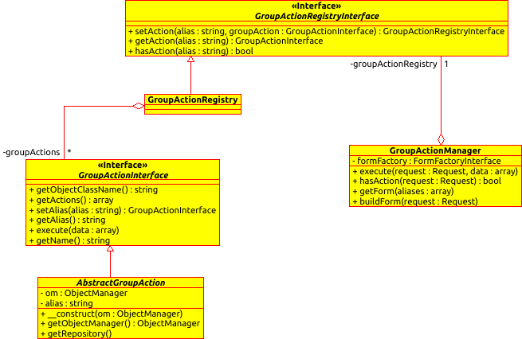

# GroupActionBundle

This Symfony bundle allows to run an action on several `abstract` data type (array, entities, documents, ...) throught a form.
The purpose is to give a simple way to create actions and display a form.

Introduction
------------

### Glossary

* A **group action** is a Symfony service that will do any work you want. It will run a sequence of intructions on a dataset.
* A **namespace** is, as its name say, a namespace to defined a list of several group actions can be retrieved by the configured namespace.

### UML Schema



Installation
------------

Add dependencies in your `composer.json` file:
```json
"require": {
    ...
     "idci/group-action-bundle": "~2.0"
},
```

Install these new dependencies in your application using composer:
```sh
$ php composer.phar update
```

Register needed bundles in your application kernel:
```php
<?php
// app/AppKernel.php

public function registerBundles()
{
    $bundles = array(
        // ...
        new IDCI\Bundle\GroupActionBundle\IDCIGroupActionBundle(),
    );
}
```

That's it, you are ready to use the bundle.

Documentation
-------------

* [How to create a group action](Resources/doc/group_action.md)
* [How to define group actions throught namespaces](Resources/doc/namespace.md)
* [How to create a group action form in your Controller](Resources/doc/group_action_form.md)
* [How to display the group action form in the view](Resources/doc/group_action_form_view.md)
